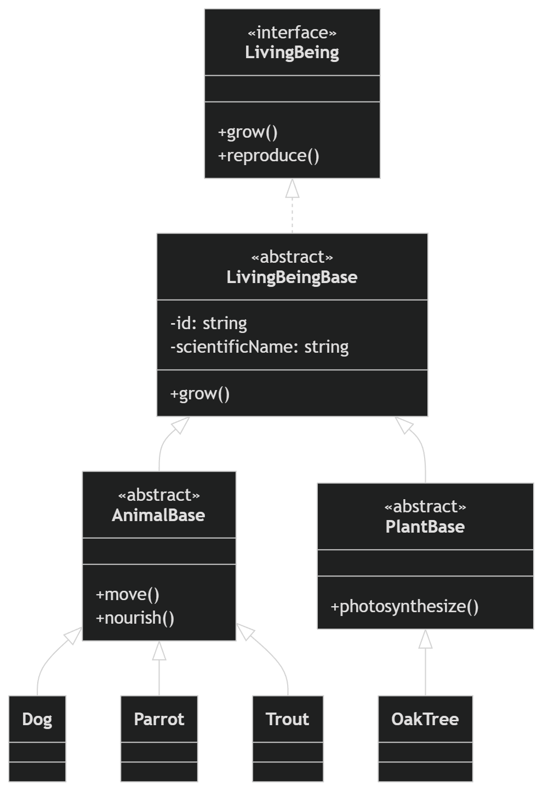
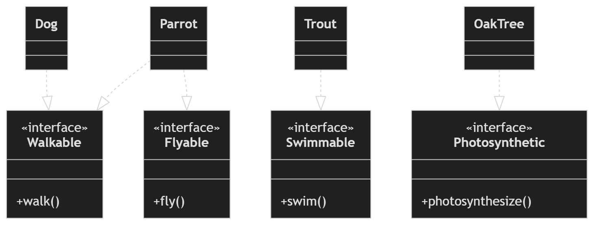
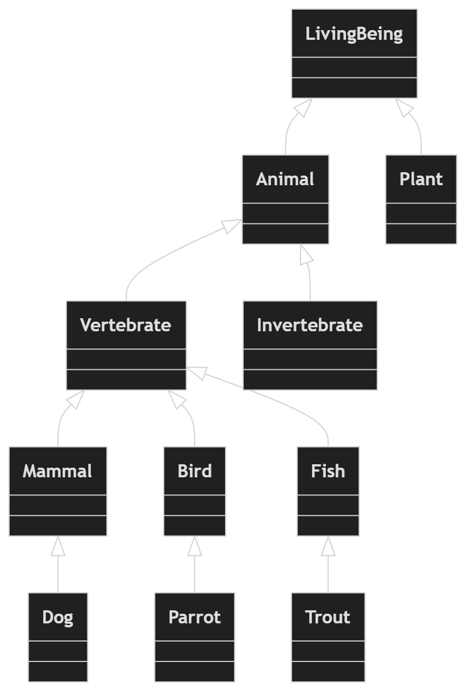
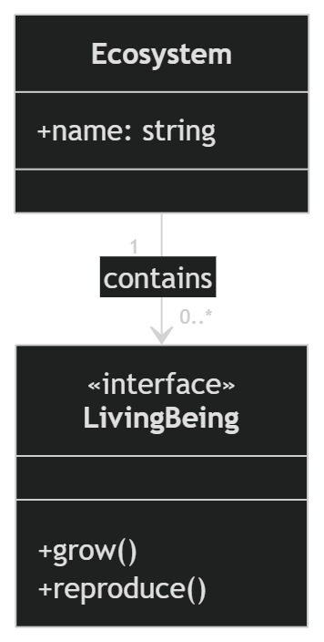
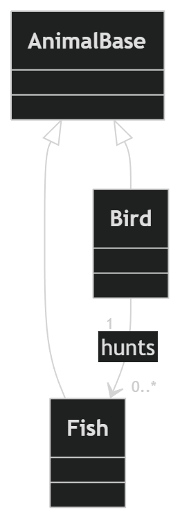
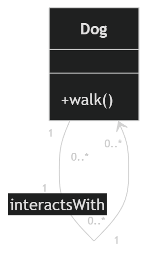
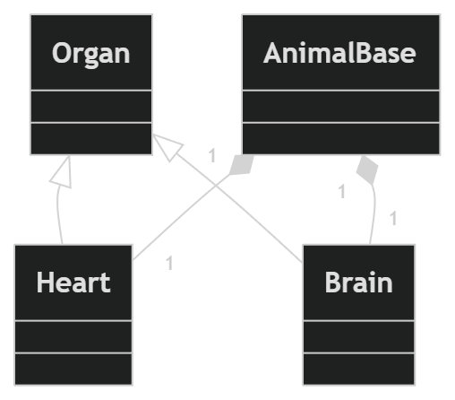
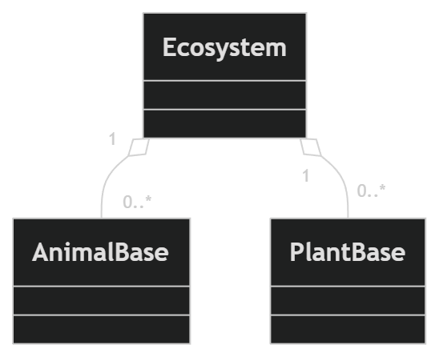
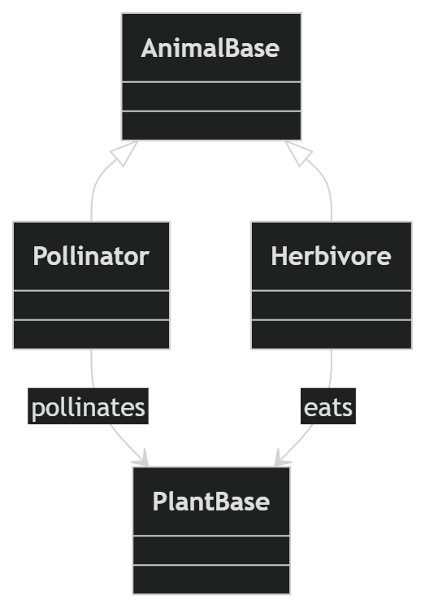

<!-- 
Universidad de La Laguna
Escuela Superior de Ingeniería y Tecnología
Grado en Ingeniería Informática
Asignatura: Programación de Aplicaciones Interactivas (PAI)

@author Álvaro Pérez Ramos
@author Pablo García de los Reyes
@author Adrián Hernández Herrera
@since 26 FEB 2026
-->

# UML representation of Living Beings taxonomy

This document presents the UML class diagrams used to model the architecture and biological domain of the project.
The diagrams represent the hierarchy of living beings implemented in TypeScript, including their behaviors, taxonomic structure, and ecological relationships.

The goal of these diagrams is to provide a clear visual representation of the system design and its relation to biological concepts such as species classification and ecosystem interactions.

## 1. Software architecture

This diagram shows the core architecture of the system.
It represents the main abstractions of the model, including:

- LivingBeing as the root abstraction
- Abstract base classes for animals and plants
- Concrete implementations representing specific species

Inheritance relationships illustrate how different species extend the base abstractions while maintaining a consistent interface.

## 2. Behaviour interfaces

This diagram represents the behavioral interfaces implemented by different organisms.

Instead of defining a single large interface, the system follows the Interface Segregation Principle, defining smaller and more specific behavior interfaces such as:

- Walking
- Flying
- Swimming
- Photosynthesis

Environmental response

Species implement only the behaviors that are relevant to them, improving modularity and flexibility.

## 3. Biological taxonomy

This diagram models the biological classification used in the project.

The hierarchy reflects the conceptual organization of living beings into major biological groups such as:

- Animals
- Plants
- Vertebrates
- Invertebrates

These classifications are used to organize species within the domain model while keeping the software architecture independent from strict biological constraints.

## 4 Ecosystem relationships

These diagrams illustrate different types of relationships between organisms and ecosystems.

They include examples of:

- Multiplicity relationships between ecosystems and living beings
- Predator–prey interactions between species
- Social structures, where organisms interact with other individuals of the same species

These models help represent ecological dynamics within the system.

## 5 Organism composition

These diagrams illustrate composition relationships within the biological model.

Composition represents strong whole–part relationships where components depend on the existence of the parent structure. Examples include:

- An organism composed of internal organs
- Ecosystems composed of different biological elements

This approach helps represent structural dependencies within the domain.

## 6 Ecological interactions

This diagram models interactions between different organisms within an ecosystem.

Examples of ecological interactions include:

- Pollination relationships between animals and plants
- Herbivory and feeding relationships
- Environmental interactions between species

These relationships extend the domain model beyond simple classification, allowing the system to represent biological interactions and ecosystem dynamics.